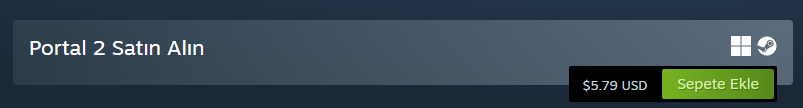
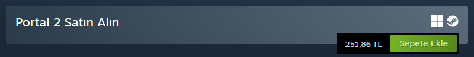
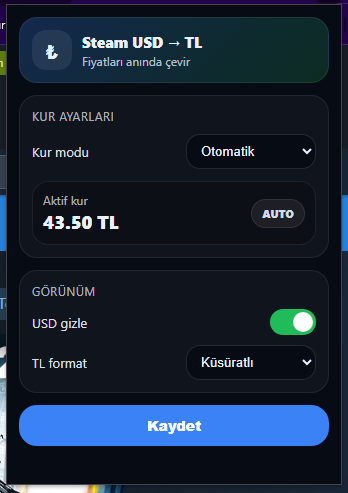

# Steam USD → TRY Converter (Chrome Extension)

Steam mağazasında görünen USD fiyatlarını TRY’ye çeviren basit bir Chrome eklentisi.

## Özellikler
- Steam fiyatlarını USD → TRY çevirme
- Otomatik kur veya manuel kur modu
- Aç / kapat anahtarı
- Dolar fiyatını gizleme modu
- TL formatı: yuvarlama veya küsüratlı gösterim

---

## Ekran Görüntüleri

| Steam sayfası (önce) | Steam sayfası (sonra) |
|---|---|
|  |  |

| Popup arayüzü |
|---|
|  |

---

## Kurulum (Chrome)
1. Bu projeyi indir:
   - `Code → Download ZIP`
   veya
   - `git clone` ile bilgisayarına çek

2. Chrome'da şu sayfayı aç:
   - `chrome://extensions`

3. Sağ üstten **Developer mode** (Geliştirici modu) aç.

4. **Load unpacked** (Paketlenmemiş öğe yükle) butonuna bas.

5. Proje klasörünü seç.

---

## Kullanım
- Steam mağaza sayfasına girince fiyatlar otomatik çevrilir.
- Sağ üstten eklenti ikonuna basarak:
  - Kur modunu değiştirebilir
  - Manuel kur girebilir
  - USD fiyatını gizleyebilir
  - Yuvarlama / küsürat seçebilirsin

---

## Notlar
- Otomatik kur özelliği üçüncü taraf bir döviz kuru API’si kullanır.
- Bu eklenti Valve veya Steam ile resmi olarak bağlantılı değildir.

---

## Lisans
MIT License
